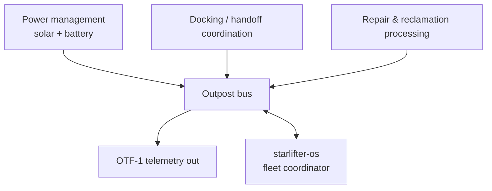

# Subsystems — Draft

Not a finalized design -- a starting point for the open questions in the
[README](../README.md).

## Deliberately out of scope for now

- **Life support / ECLSS.** An uncrewed depot doesn't need it, and a
  crewed one is enough of a separate, safety-critical design problem that
  bundling it into an early "systems software" scaffold would either get
  it wrong or block everything else on a decision (crewed vs. uncrewed)
  that hasn't been made.
- **Specific power hardware choice.** Whether this is solar-only,
  solar+battery, or something else depends on the outpost's location
  (surface vs. depot, sun exposure) which isn't chosen yet.

## What a first uncrewed depot probably needs

Docking/handoff coordination and OTF-1 telemetry reporting are the two
pieces every version of this repo will need regardless of crewed/uncrewed
or location decisions -- reasonable candidates for whatever gets built
first, once someone starts.
